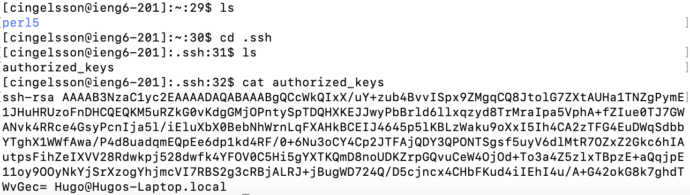

# Lab Report 2

## Part 1

### ChatServer.java
This is the code for my Chat Server:
```
class Handler implements URLHandler {
    private final String INCORRECT_FORMAT = "Incorrect format: Use \"/add-message?s=<message>&user=<username>\"";

    String chat = "";
    int chatNumber = 0;

    public String handleRequest(URI url) {
        if (url.getPath().equals("/")) {
            return chat;
        } else if (url.getPath().equals("/add-message")) {
            String query = url.getQuery();
            if (query.startsWith("s=")) {
                String[] queryParts = query.split("&");

                if (queryParts.length >= 2) {
                    if (!queryParts[1].startsWith("user=")) {
                        return INCORRECT_FORMAT;
                    }

                    String[] message = queryParts[0].split("=");
                    String[] user = queryParts[1].split("=");

                    chatNumber++; // just here because I think it's nice to keep track of
                    chat = chat.concat(String.format("%s: %s\n", user[1], message[1]));
                    return chat;
                }
                else {
                    return "Missing username!";
                }
            }
            else {
                return INCORRECT_FORMAT;
            }
        } else {
            return "404 Not Found!";
        }
    }
}
```

Before describing the two screenshots, I wanted to also explain what happens when the server starts up since that's also running a few methods. First, on running ChatServer.java, its main method starts a server from the Server.start() method with the port number used as a command line argument, along with a new Handler() object. When Server.start() runs, it creates a new HttpServer(), which then creates a new context for the Handler() passed in. Then, whenever a new webpage is loaded, the context runs a handle() method, which handles the URI using the Handler() object and prints out something for the user to look at.

### Screenshot 1 (working example)


In this example, the handle(final HttpExchange exchange) method first gets called (as described above), which then calls handleRequest(URI uri) from ChatServer.java.

In the handle() function, "exchange" is the parameter that lets the program speak to the server. It is what lets us ask for the URI using "exchange.getRequestURI()"; it is also what lets us write to the server by using "exchange.getResponseBody()".

For the handleRequest() function, "url" is the parameter that lets us know what the user typed into the search bar. It can be split up into its components using "url.getPath()" and "url.getQuery()" (you can also get the host address using "url.getHost()", but we don't need that for this server). In particular, using the URL in the screenshot, "url.getPath()" returns "/add-message" and "url.getQuery()" returns "s=So%20True&user=jpolitz" in this case.

The Handler() class has a String field named "chat", which is a record of the chat up until this point. In this case, it is a very long value containing "\n"s to split up the four messages sent before typing in this URL. The Handler() class also contains an int field named "chatNumber", which I just chose to include in case I ever wanted to expand on the server and needed to know how many messages had been sent so far; it currently has a value of 4.

After this specific request, the field "chat" had the String "jpolitz: So true\n" appended to it (this happened before printing to the server, so it shows the updated version of "chat" on the webpage). "chatNumber" was also incremented to 5.

### Screenshot 2 (incorrect formatting)


In this example, the same functions are called as in the previous example. Furthermore, the parameters of the functions serve effectively the same purpose.

That said, there is an important distinction between what "url.getPath()" returns now: "st=WRONG&user=FORMAT". Notably, whoever typed in this URL (me) accidentally put the first token of the query to be "st" instead of "s". This made the handleRequest() function unable to add a new message to the chat and instead print out an error message to the user.

Since the program couldn't add anything to the chat, the values of the two fields stay exactly the same as they were before. In fact, the values they had were completely irrelevant this time when requesting the server since they never got accessed or changed.

## Part 2

I want to first note that `ls` actually doesn't show any files in my home directory starting with a period. I was able to see them instead by using `cd .` and then pressing tab, which shows possible follow-up files for me.


This is how I accessed my private key. For obvious reasons, I'm only showing the first couple of lines out of the entire key. Absolute path to private key: `/Users/Hugo/.ssh/id_rsa`


And this is how I accessed my public key. Absolute path to public key on ieng6: `/home/linux/ieng6/oce/9f/cingelsson/.ssh/authorized_keys`


Finally, this is a screenshot showing me logging into `ieng6` without the use of a password.

## Part 3
Something I learned this week was that you're able to not only log in to remote servers and edit their files using `ssh`, but that you can also copy files between servers using `scp`. I feel like this is a powerful tool that we can use to make our lives much easier. If I had to copy a file from one server to another before, I think the best solution I could have come up with was to upload the file to GitHub and then download it on the other server manually. Now, I see there's a much better way!
