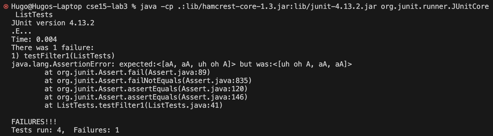

# Lab Report 3

## Part 1
For this part, I decided to use the `filter` method in ListExamples.java.

Before getting into any of the bugs, I want to show the filter that I used in the tests. It looks through a String and only returns true if it contains the character `A`:
```
class CheckHasA implements StringChecker {
    @Override
    public boolean checkString(String s) {
        for (int i=0; i<s.length(); i++) {
            if (s.charAt(i) == 'A')
                return true;
        }

        return false;
    }
}
```

### Failure-Inducing Input
```
@Test
public void testFilter1() {
    List<String> list = Arrays.asList("aA", "aBa", "not in the list!", "aA", "uh oh A");
    List<String> expected = Arrays.asList("aA", "aA", "uh oh A");

    assertEquals(expected, ListExamples.filter(list, new CheckHasA()));
}
```

### Non-Failing Input
```
@Test
public void testFilter2() {
    List<String> list = Arrays.asList("aA", "aBa", "not in the list!", "uh oh A", "aA");
    List<String> expected = Arrays.asList("aA", "uh oh A", "aA");

    assertEquals(expected, ListExamples.filter(list, new CheckHasA()));
}
```

### Symptom


As you can see, only testFilter1 runs into an error (there are also some test cases for other methods that pass), ending up with the reverse list of what we'd expect.

### The Bug

Code before:
```
static List<String> filter(List<String> list, StringChecker sc) {
    List<String> result = new ArrayList<>();
    for(String s: list) {
        if(sc.checkString(s)) {
            result.add(0, s);
        }
    }
    return result;
}
```

Code after:
```
static List<String> filter(List<String> list, StringChecker sc) {
    List<String> result = new ArrayList<>();
    for(String s: list) {
        if(sc.checkString(s)) {
            result.add(s);
        }
    }
    return result;
}
```

The bug fix was to change `result.add(0, s)` into `result.add(s)`, which makes the filter add each item to the end of the list instead of the start. This fixes the issue because we want the returned list to have each item in the order they originally occurred in the input list; adding items to the start of the list wrongly reverses the order. The non-failing input still gave the correct answer because its result is a palindrome.

## Part 2
