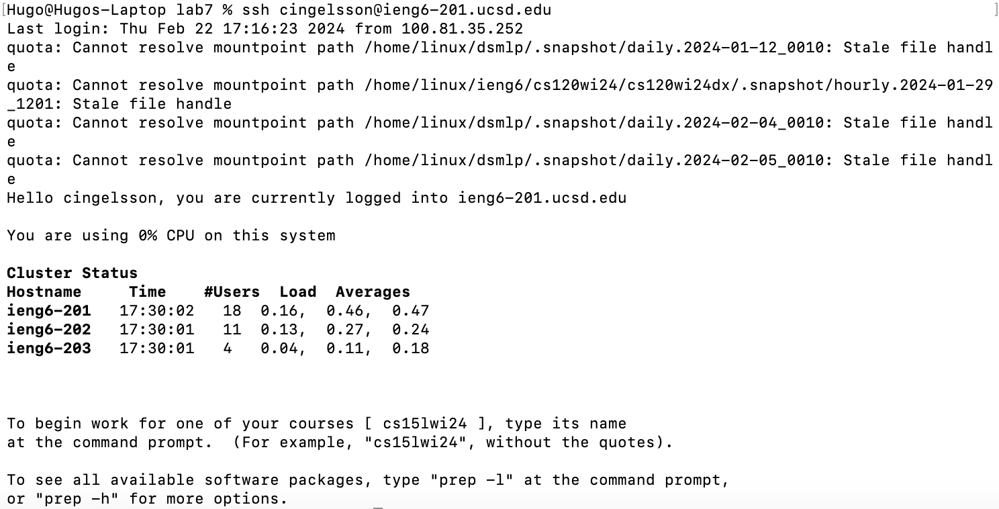

# Lab Report 4
For this lab, I'll be going through the steps I went through to fix a bug in a program.

## Logging into ieng6

Keys pressed: `ssh cingelsson@ieng6-201.ucsd.edu<enter>`
..Explanation..

## Cloning my fork
..Image..
Keys pressed: `cs15lwi24<enter>`, then `git clone git@github.com:HugoIngelsson/cse15l-lab7.git<enter>`
..Explanation..

## Running the tests, with failures
..Image..
Keys pressed: `cd cse15l-lab7/<enter>`, then `bash test.sh<enter>`
..Explanation..

## Editing the code file
..Image..
Keys pressed: `vim ListExamples.java<enter>`, then `?1<enter>nr2<esc>:wq<enter>`
..Explanation..

## Running the tests, without failures
..Image..
Keys pressed: `bash test.sh<enter>`
..Explanation..

## Committing and pushing the change to GitHub
..Image..
Keys pressed: `git add ListExamples.java<enter>`, then `git commit -m "Code fix<enter>"`, and then finally `git push`
..Explanation..
